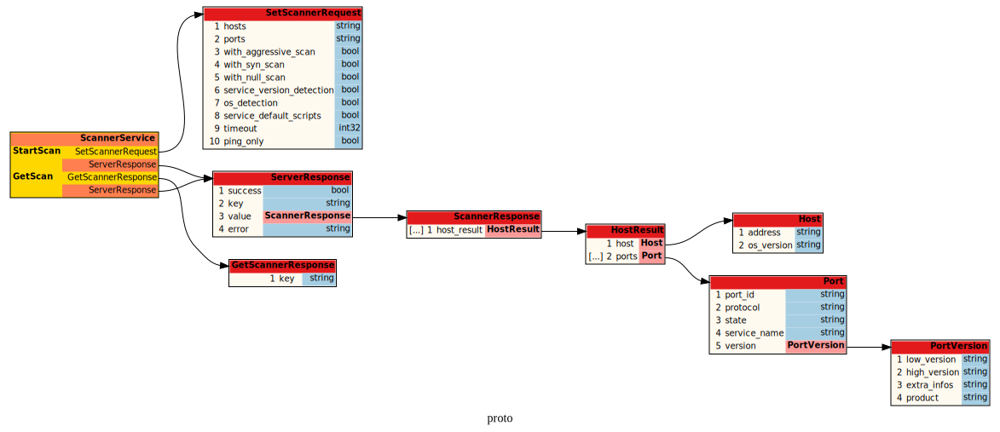

# gRPC nmap scanner (WIP)

It's a distributed scanner

# Requirement

- docker-compose
- docker

# Architecture

## gRPC



- 1 server that can run sync scan task
- 1 redis (or 2) (ideally clusters) acting as a message broker and database storage
- x worker that can run y consumers (async scan tasks)

All scan results are stored in the database (redis only for the moment)

# Build

```bash
$ make cert
$ make
```

# Server

Start the server as root with

```bash
$ make cert
$ make
```

# Client

Run a test scan with

```bash
$ make testscan
```

Or

```bash
$ grpcurl -cacert ./cert/ca-cert.pem -key ./cert/client-cyrinux-key.pem -cert ./cert/client-cyrinux-cert.pem -servername server -d '{"hosts":"scanme.nmap.org,levis.name","os_detection":true,"fast_mode":true,"service_default_scripts":false,"service_version_detection":true,"scan_speed":5,"ports":"443","service_scripts":"vulners","use_tor":true,"timeout":3600}' -H "Username: admin" -H "Password: admin123" 127.0.0.1:9000 proto.ScannerService.StartScan

$./bin/scanner StartScan '{"hosts":"scanme.nmap.org,levis.name","os_detection":true,"fast_mode":true,"service_default_scripts":false,"service_version_detection":true,"scan_speed":5,"ports":"443","service_scripts":"vulners","use_tor":true,"timeout":3600}'
```

# Testing

Choas monkey

```bash
$ docker run -it --rm -v /var/run/docker.sock:/var/run/docker.sock gaiaadm/pumba  -l info --random  --interval 30s kill
```

# Resources

- [GRPC TLS](https://dev.to/techschoolguru/how-to-create-sign-ssl-tls-certificates-2aai)
