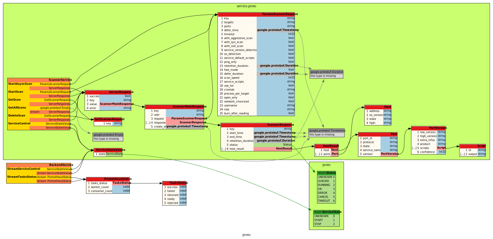

# gRPC nmap scanner

It's a distributed scanner

# Requirement

- docker-compose
- docker

# Architecture

## gRPC



- 1 server that can run sync scan task
- 1 redis (or 2) (ideally clusters) acting as a message broker and database storage
- x worker that can run y consumers (async scan tasks)

All scan results are stored in the database (redis only for the moment)

# Build

```bash
$ make
```

# Server

Start the server as root with

```bash
$ make
```

# Client

Run a test scan with

```bash
$ make testscan
```

Or

```bash
$ grpc_cli call 127.0.0.1:9000 scanner.ScannerService.Scan "hosts:'google.com',ports:'80,443'"
```
